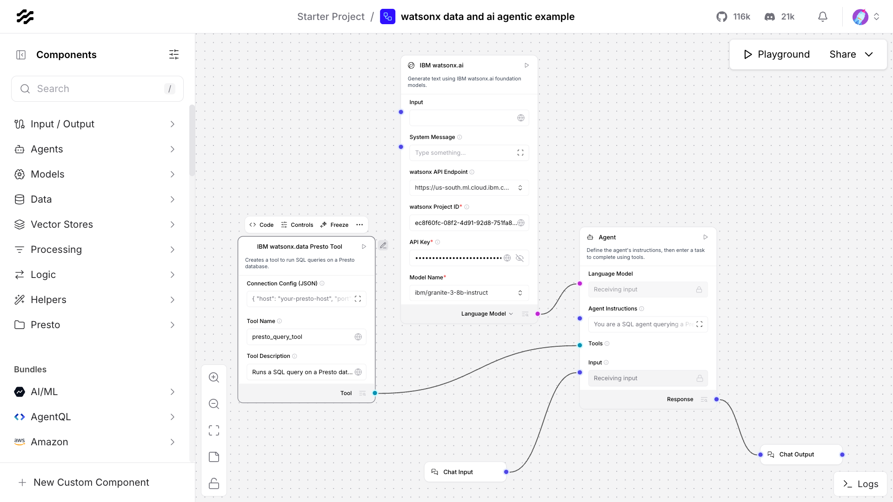
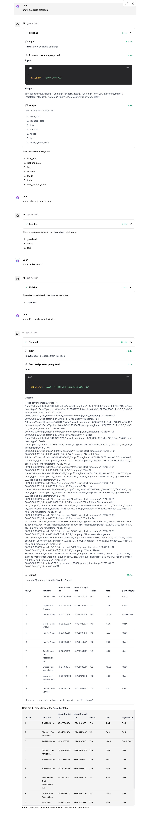

# Langflow Custom Presto Component for watsonx.data

This project provides a custom component for [Langflow](https://langflow.org/) that allows agents to query data from IBM watsonx.data data lakehouse via Presto.

## Getting Started

There are two ways to use these components:

### Option 1: Import the Example Flow (Easiest)
If you just want to get up and running quickly, you can import the complete agentic flow.

1.  Follow the **Installation** steps below to set up your environment and install dependencies.
2.  Navigate to your Langflow UI and click the "Import" button.
3.  Select the `watsonx data and ai agentic example.json` file from this project's directory.
4.  Once imported, you will need to update two components with your specific credentials:
    *   **IBM watsonx.data Presto Tool**: Fill in your Presto `Connection Config (JSON)`.
    *   **Agent**: Provide your `watsonx API Key` and select your desired model.
5.  If your watsonx.data instance uses a custom SSL certificate, follow the **Handling SSL Certificates** guide below.
6.  You can then run the flow and begin chatting with your data.

**Note:** This flow was built and tested with Langflow version `1.5.1`.

### Option 2: Manual Installation
Follow these steps if you want to add the components to your Langflow instance to use in any flow.

1.  Follow the **Installation** steps below.
2.  The components will appear in the "Presto" category in the Langflow UI.

## Components

This project provides two components, found under the **Presto** category in Langflow.

### 1. IBM watsonx.data Presto Tool
This component builds a LangChain `Tool` that can be connected to an agent. It allows the agent to intelligently generate and execute SQL queries on a Presto database based on natural language prompts. This is the recommended component for building agentic workflows.

### 2. Presto Watsonx Query
This component executes a predefined SQL query against a Presto database and returns the result as a Langflow `Data` object, which can be easily converted to a DataFrame. It is useful for static queries within a flow.

## Handling SSL Certificates (If Required)

These steps are only necessary if you are connecting to a Presto server that uses a self-signed or custom corporate SSL certificate. If your server's certificate is issued by a standard, trusted Certificate Authority, you may not need to perform these steps.

Connecting to a server with a self-signed or corporate SSL certificate from within a Python environment can be complex. The Python networking libraries require explicit configuration to trust your server's certificate.

### Step 1: Download the Server's SSL Certificate Chain

You must first download the full certificate chain from the server. This is done using the `openssl` command-line tool.

1.  **Define your host and port:**
    ```bash
    HOST=<your-watsonx-data-host>
    PORT=<your-presto-port>
    ```

2.  **Run the `openssl` command:**
    This command connects to the server, extracts the certificate chain, and saves it to a file named `/tmp/presto-chain.pem`.
    ```bash
    echo -n | openssl s_client -connect ${HOST}:${PORT} -servername ${HOST} -showcerts 2>/dev/null \
      | sed -n '/-BEGIN CERTIFICATE-/,/-END CERTIFICATE-/p' > /tmp/presto-chain.pem
    ```

### Step 2: Set Environment Variables

Before launching Langflow, you must set two environment variables in your terminal. These tell the Python `requests` library (used by the Presto client) to use your custom certificate file and to bypass any corporate proxies for this specific host.

```bash
export REQUESTS_CA_BUNDLE=/tmp/presto-chain.pem
export NO_PROXY=<your-watsonx-data-host>
```

**IMPORTANT:** These variables must be set in the *same terminal session* from which you will launch Langflow.

## Installation

### Prerequisites

- Python 3.13+ (tested with 3.13.7)
- `pip` and `venv`

### 1. Create and Activate a Virtual Environment

```bash
python3 -m venv .venv
source .venv/bin/activate
```

### 2. Install Dependencies

Install Langflow and the necessary Python packages for the component.

```bash
pip install "langflow" "pandas" "presto-python-client" "requests"
```

### 3. Install the Custom Component

Run the provided installation script. This copies the component into your virtual environment, making it available to Langflow.

```bash
./install_components.sh
```

## Running Langflow

Ensure your environment variables from Step 2 are set, and then run Langflow from the same terminal.

```bash
langflow run
```

## Using the Components in Langflow

1.  Drag the desired component (**IBM watsonx.data Presto Tool** or **Presto Watsonx Query**) onto the canvas.
2.  The `Connection Config (JSON)` is pre-filled with placeholder values. Update it with your specific host, port, user, password, and the correct path to your `.pem` file.
3.  For the **Presto Watsonx Query** component, modify the `sql_query` to your desired query.
4.  For the **IBM watsonx.data Presto Tool**, configure the `Tool Name` and `Tool Description` to guide the agent.
5.  Connect the output to other components. The `Tool` output should be connected to an agent's `Tools` input.

## Example Agentic Flow

Below is an example of how to use the "IBM watsonx.data Presto Tool" with an agent in Langflow. The tool is configured with the database connection details and then passed to the agent's `Tools` input.



### Chatting with the Data

Once the flow is configured, you can interact with your Presto database through the Langflow playground. The agent will use the tool to generate and execute SQL queries based on your natural language questions.


